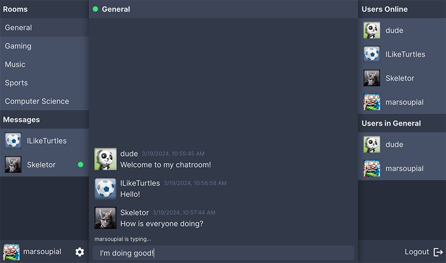

Site is currently deployed [here](https://messaging-app-uz05.onrender.com).
Monorepo located [here](https://github.com/Mark-Elliott5/messaging-app).

This messaging-app-backend project features:

- Typescript
- React SPA
- Online chatroom using websockets
- Direct messaging
- Profiles with avatars and bios
- CRUD operations with mongoose
- Rate limiting
- Profanity filter

This backend is to be used with my messaging-app-frontend repository.
Navigate to the monorepo linked above for more information.

